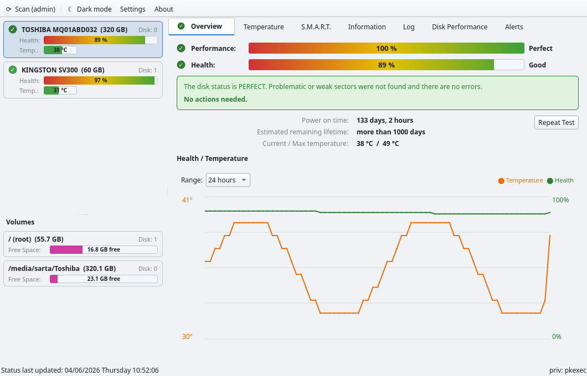
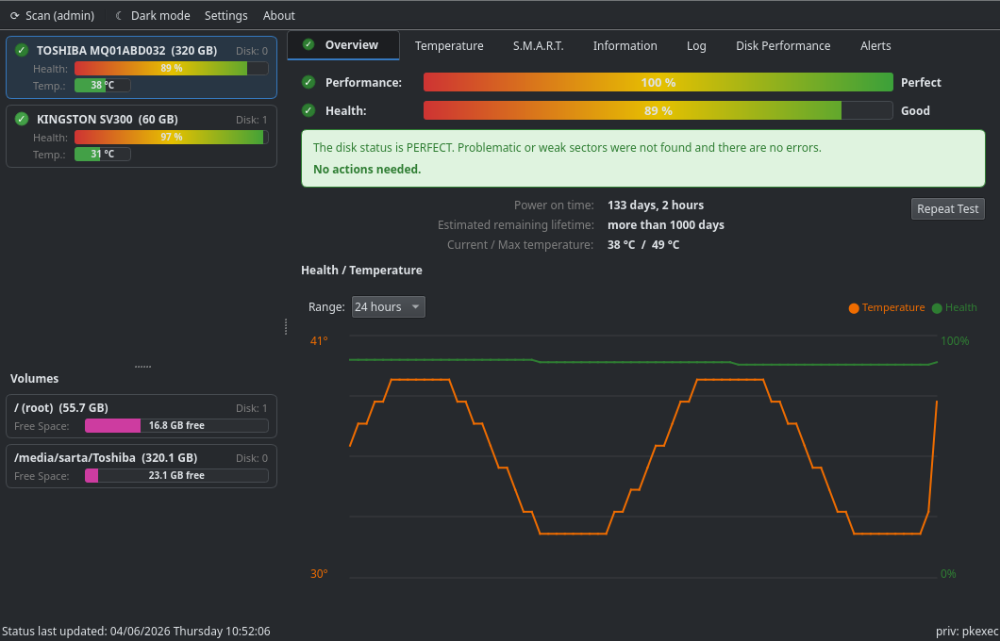
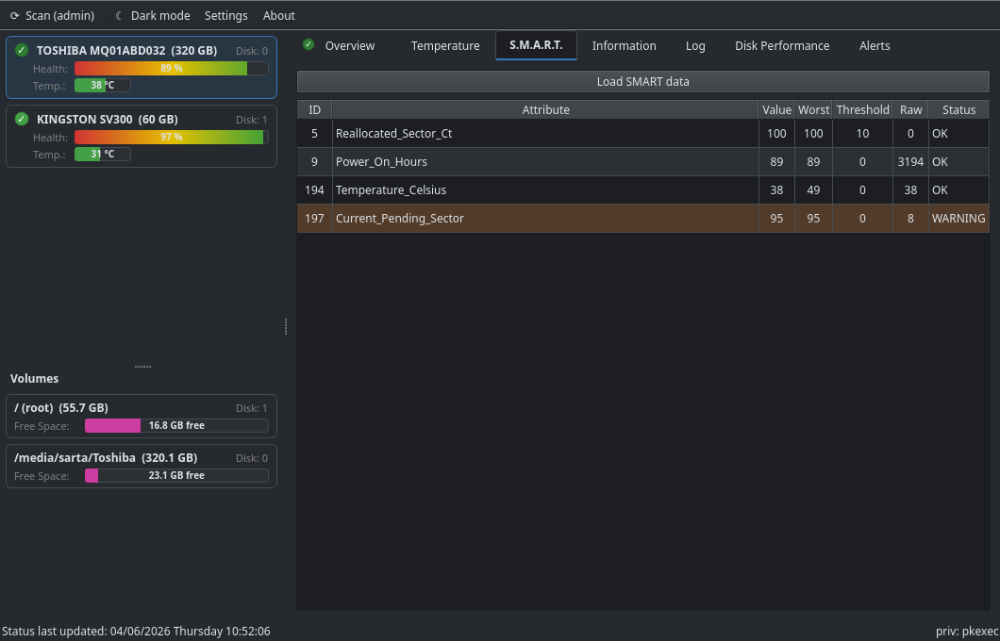

# DiskMaster

> A superpower HDD/SSD/NVMe monitoring tool for Linux — a unified PyQt6 front-end
> for Hard Disk Sentinel, `smartctl`, sysfs and `nvme-cli`.

DiskMaster brings the familiar [Hard Disk Sentinel](https://www.hdsentinel.com/)
workflow to the Linux desktop: health, temperature, SMART attributes, self-tests
and history for every disk — in one window, without running the whole app as root.



<table>
  <tr>
    <td></td>
    <td></td>
  </tr>
</table>

## Features

- **Multi-disk dashboard** — every HDD / SSD / NVMe in one place, with status
  badges, health gradient bars and temperature bars (HDSentinel-style layout).
- **Mounted-volume panel** — free-space bars for each mounted filesystem.
- **Seven tabs** — Overview, Temperature, S.M.A.R.T., Information, Log
  (self-tests), Disk Performance (live I/O), Alerts.
- **Real-time polling** — a lightweight quick poll keeps temperature/health
  fresh between full scans.
- **SMART attributes** — full table with failed/warning rows highlighted.
- **Self-tests** — start Short/Extended tests and read the self-test log.
- **History** — temperature & health charted over time (SQLite-backed), drawn
  with QPainter so there is **no charting dependency**.
- **Desktop notifications** — temperature / health / SMART-failure alerts, with
  an alert log.
- **Tools** — export reports (TXT/HTML/XML) and AAM control for supported HDDs.
- **Light & dark themes** — toggle from the toolbar.
- **No full-root** — privileged reads go through a single long-lived helper
  authenticated once per session via `pkexec`.

## Requirements

- Linux (X11 or Wayland; KDE / GNOME / XFCE …)
- Python 3.11+
- PyQt6
- [`smartmontools`](https://www.smartmontools.org/) (`smartctl` ≥ 7.0)
- [Hard Disk Sentinel for Linux](https://www.hdsentinel.com/hard_disk_sentinel_linux.php)
  (free download — see note below)
- `nvme-cli` (optional, for NVMe drives)
- `pkexec` (from polkit) or `sudo` for privileged access

## Running

```bash
python3 diskmaster/main.py
```

The disk list populates immediately from sysfs (no admin needed). Click
**⟳ Scan (admin)** to read health/SMART data — you'll be prompted once by
`pkexec`, then polling runs automatically.

> **HDSentinel binary is not bundled.** Hard Disk Sentinel is freeware and its
> redistribution may be restricted, so download it yourself and place the
> `hdsentinel` binary on your `PATH` (or in `diskmaster/assets/`). DiskMaster
> auto-detects it.

## How privileges work

`hdsentinel` and `smartctl` need root to read `/dev`. Rather than prompting on
every 30-second poll, DiskMaster spawns one **privileged helper**
(`core/privhelper.py`) via `pkexec`, authenticated once per session. The helper
only accepts a small whitelist of commands with validated device arguments — no
arbitrary execution. Non-privileged data (sysfs I/O, mounted volumes, the
history DB) never goes through the helper.

## Architecture

```
diskmaster/
├── main.py              # entry point
├── core/
│   ├── service.py       # orchestrates privileged + non-privileged data
│   ├── privhelper.py    # runs as root (pkexec), command whitelist
│   ├── privclient.py    # spawns + talks to the helper (JSON-lines)
│   ├── poller.py        # quick (-solid) + full (-xml) polling thread
│   ├── db.py            # SQLite history / alerts
│   ├── notifier.py      # threshold alerts + notify-send
│   ├── backends/        # smartctl, sysfs (I/O), nvme, volumes
│   └── parser/          # HDSentinel XML + solid parsers
├── ui/                  # PyQt6 widgets (HDSentinel-style tabs, theme, charts)
└── config/settings.py   # TOML config (~/.config/diskmaster/config.toml)
```

## Tests

No third-party test deps required:

```bash
python3 tests/test_core.py
python3 tests/test_phase2.py
```

## License

The DiskMaster source is the project author's own work. Hard Disk Sentinel is a
separate, third-party freeware product and is **not** included in this
repository.
